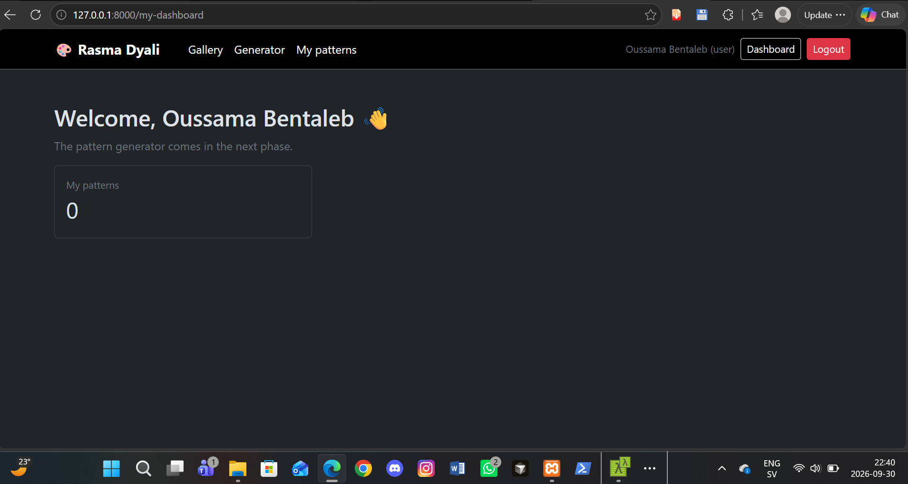
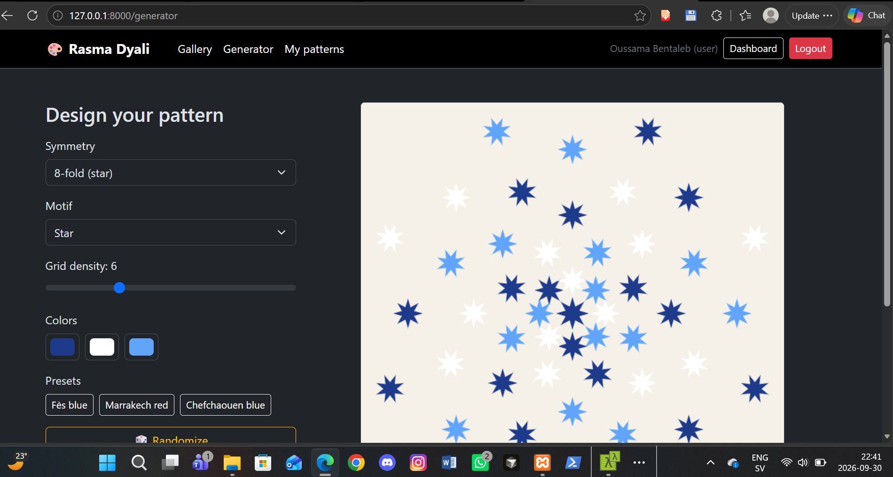
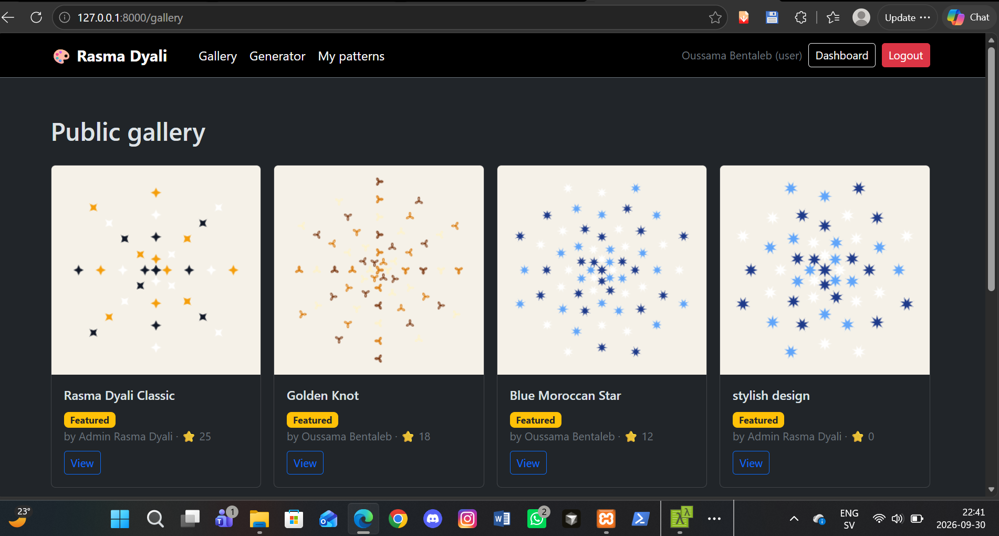
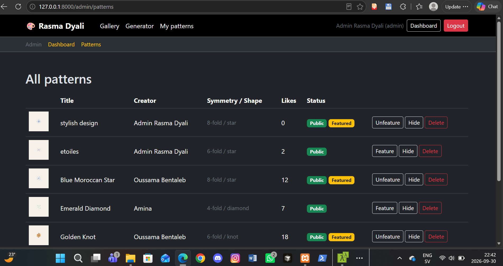
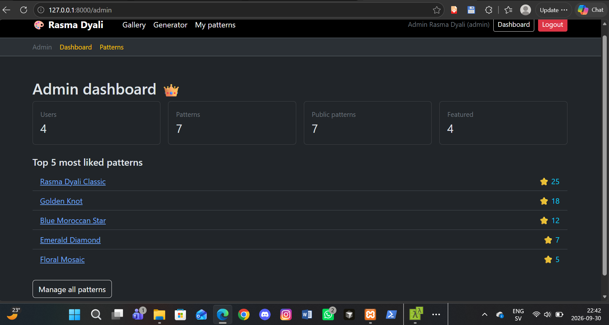

# 🎨 Rasma Dyali

A generative pattern designer for Moroccan zellige-style art. Pick a symmetry, a motif, and a color palette, and watch a full geometric pattern draw itself live on canvas — no page reloads, no waiting. Save it to a public gallery, like other people's designs, or just download the PNG and go.

Unlike a typical CRUD app, the core of this project is client-side generative art: real-time Canvas rendering driven by rotational symmetry math (4-fold, 6-fold, 8-fold), not database-driven forms.

## 📸 Screenshots

**User dashboard**


**Pattern generator — live canvas**


**Public gallery**


**Admin — pattern moderation**


**Admin dashboard**


## ✨ Features

- 🎨 **Live Canvas generator**: every control (symmetry, motif, grid density, colors) redraws the pattern instantly in the browser, with no server round-trip
- 🔄 **Rotational symmetry engine**: 4-fold, 6-fold and 8-fold patterns built from a single motif reflected and rotated into a full rosette — real geometry, not a static image swap
- 🖌️ **Four motif types**: star, diamond, knot, and floral, each drawn with its own Canvas path logic
- 🎲 **Randomize**: instant inspiration with one click
- 🌈 **Traditional color presets**: Fès blue, Marrakech red, Chefchaouen blue, alongside free color pickers
- ⬇️ **PNG download**: export any pattern straight from the canvas, no account required
- 🖼️ **Public gallery**: save a pattern to share it, browse others', like your favorites
- 👑 **Admin moderation**: feature, hide, or delete any pattern; dashboard with top-liked patterns
- 🛡️ **Security**: rate-limited login, server-side role enforcement, one-like-per-user enforced at the database level

## 🛠️ Tech stack

| Technology | Usage |
|---|---|
| Laravel 13 | Backend: auth, gallery, admin |
| PHP 8.3 | Language runtime |
| MySQL | Database |
| Blade | Server-rendered views |
| Bootstrap 5 | UI framework |
| Vanilla JavaScript + Canvas API | Live pattern rendering (no framework, no build step) |

## 🚀 Installation

```bash
# Clone the project
git clone https://github.com/oussamabentaleb04/rasma-dyali.git
cd rasma-dyali

# Install dependencies
composer install

# Configure environment
cp .env.example .env
php artisan key:generate

# Set your database credentials in .env, then:
php artisan migrate --seed

# Run it
php artisan serve
```

Visit `http://127.0.0.1:8000`.

## 🔑 Test accounts

The seeder creates three demo accounts:

| Role | Email | Password |
|---|---|---|
| Admin | admin@rasmadyali.com | Admin@12345 |
| User | oussama@rasmadyali.com | Password@123 |
| User | amina@rasmadyali.com | Password@123 |

⚠️ These are local development credentials only — never use them on a public deployment.

## 📁 Project structure
app/
├── Http/Controllers/ # Auth, Generator, Pattern, Admin*, Dashboard
├── Http/Middleware/ # RoleMiddleware (role-based access control)
├── Models/ # User, Pattern, PatternLike
database/
├── migrations/ # users, patterns, pattern_likes
└── seeders/ # Demo users and sample patterns
public/js/
└── pattern-renderer.js # The Canvas symmetry-drawing engine, shared by every view
resources/views/
├── generator/ # The live pattern designer
├── patterns/ # Gallery, detail page, "my patterns"
├── admin/patterns/ # Moderation table
routes/web.php # All application routes

## 👨‍💻 Author

**Oussama Bentaleb**

🐙 [GitHub](https://github.com/oussamabentaleb04)

## 📄 License

This is a personal portfolio project, built for learning purposes.